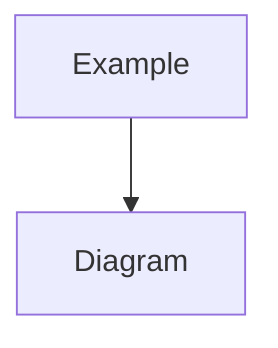

# Generate Mermaid Diagram

Analyze the provided code, architecture, or concept and generate a clear Mermaid diagram that visualizes relationships/flow/structure.

Guidelines:
- Pick an appropriate diagram type (`flowchart`, `sequenceDiagram`, `classDiagram`, `erDiagram`, `stateDiagram-v2`, etc.)
- Keep diagrams readable (split into multiple diagrams if needed)
- Use clear labels and group related nodes with subgraphs

Output format: wrap the diagram in a Mermaid code block:

