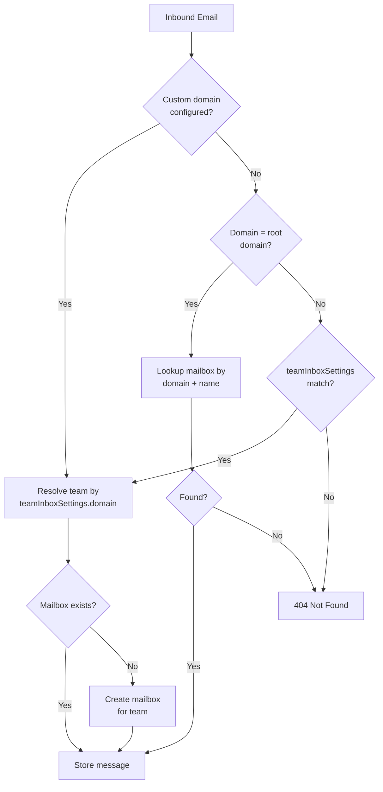

This system supports both a shared root domain and per‑team custom domains.

## Domain layout

- **Root inbound domain** is set via `INBOX_ROOT_DOMAIN` (API) and `EMAIL_DOMAIN` (worker).
- **Custom domain** is stored in `teamInboxSettings.domain`.
- Each organisation may also use a subdomain under the root (for example `company1.in.plop.email`).

## Mailbox resolution rules

1. **Custom domain configured**
   - `apps/api` resolves the team by `teamInboxSettings.domain = <domain>`.
   - If a mailbox doesn't exist for the team, it is created on first inbound message.

2. **No custom domain**
   - If the inbound domain matches `INBOX_ROOT_DOMAIN`, the API looks up the mailbox by `{ domain: root, name: mailbox }`.
   - If no mailbox exists for the root domain, the webhook returns **404**.

3. **Unknown non‑root domain**
   - If the domain is not the root and there's no `teamInboxSettings` match, the webhook returns **404**.

## Tags and mailbox names

- `support+billing@...` stores the message under mailbox `support` with tag `billing`.
- `mailboxWithTag` is preserved as the full local‑part (`support+billing`).
- Tags are lower‑cased and searchable via the Messages API.

<Callout type="info">
Mailbox names are always normalized to lowercase. Keep mailbox naming consistent in test fixtures and docs.
</Callout>
