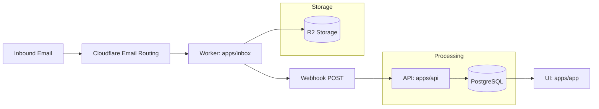

This is the end‑to‑end flow for inbound email.

## High‑level flow

<Steps>
<Step>
**Cloudflare Email Routing**

Inbound email is routed to the Cloudflare Worker (`apps/inbox`) via catch‑all rules.
</Step>

<Step>
**Worker storage**

The worker stores the raw `.eml` in R2 at `raw/<domain>/<mailbox>/<id>.eml` and metadata in `messages/unprocessed/<domain>/<mailbox>/<id>.json`.
</Step>

<Step>
**Webhook to API**

If `WEBHOOK_URL` is set, the worker posts a webhook payload to `apps/api` (`/webhooks/inbox`). If the response is 2xx, metadata moves to `messages/processed/...`.
</Step>

<Step>
**API persistence**

`apps/api` validates the payload, resolves the team/mailbox, and inserts a record into `inboxMessages`.
</Step>

<Step>
**UI consumption**

`apps/app` reads the data through API/trpc and renders message content and mailbox metadata.
</Step>
</Steps>

## What gets stored

- Raw message: `.eml` blob in R2.
- Metadata: sender, recipients, subject, received time, headers, plus HTML/text content (best effort).

## Failure modes

- If the webhook fails, the raw message still exists in R2 and metadata stays in `unprocessed`.
- The worker can retry the webhook via `POST /admin/inboxes/:localPart/messages/:id/webhook`.

<Callout type="warning">
If you change webhook auth or the webhook URL, failed messages will not move to `processed` until a successful retry occurs.
</Callout>
