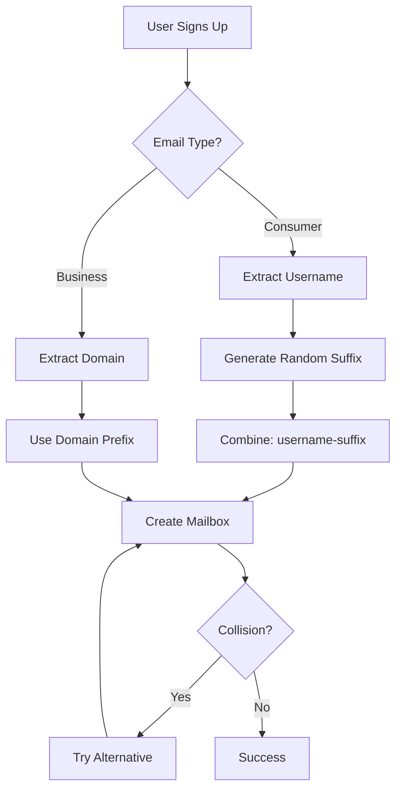
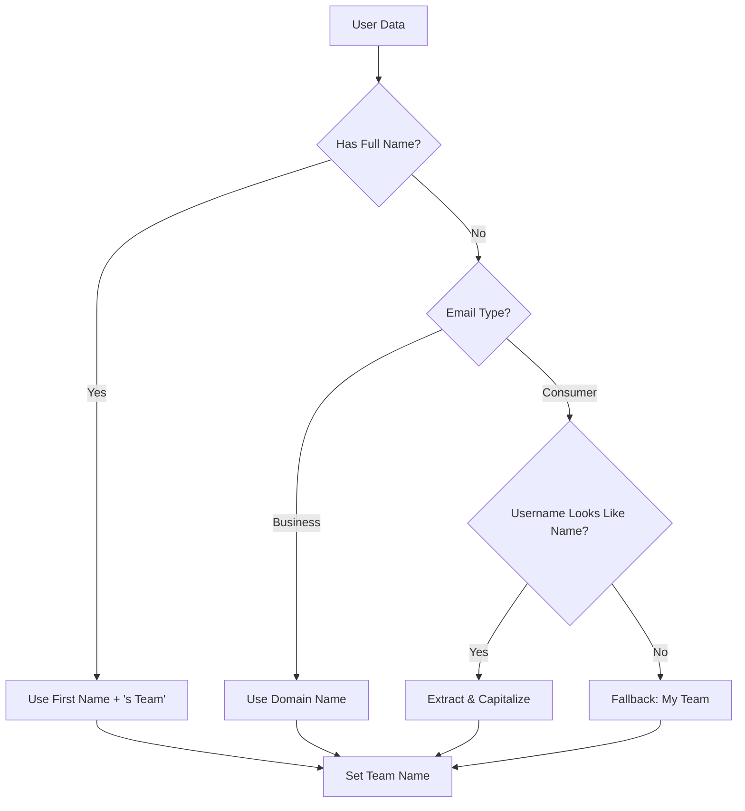

Plop uses intelligent email and team name generation to create personalized, secure, and collision-free mailbox addresses during onboarding.

## Smart Mailbox Generation

### Consumer vs Business Email Detection

The system automatically detects **consumer email providers** (Gmail, Yahoo, Outlook, etc.) and generates appropriate mailbox names:

<Tabs items={['Consumer Email', 'Business Email']}>
<Tab value="Consumer Email">
```typescript
// Input: john.doe@gmail.com
// Mailbox: john.doe-x7k2@in.plop.email

extractMailboxSeedFromEmail('john.doe@gmail.com')
// Returns: 'john.doe-x7k2' (username + random suffix)
```

**Why?** Using "gmail" as the mailbox would be generic and cause collisions. The username + random suffix ensures uniqueness while remaining personal.
</Tab>

<Tab value="Business Email">
```typescript
// Input: sarah@acme.com
// Mailbox: acme@in.plop.email

extractMailboxSeedFromEmail('sarah@acme.com')
// Returns: 'acme' (domain prefix)
```

**Why?** Business domains represent company identity, so using the domain name creates professional, recognizable mailboxes.
</Tab>
</Tabs>

### Consumer Email Providers (24+)

The following domains trigger consumer email handling:

- **Google**: gmail.com, googlemail.com
- **Microsoft**: outlook.com, hotmail.com, live.com, msn.com
- **Yahoo**: yahoo.com, ymail.com, yahoo.co.uk, yahoo.ca, yahoo.com.au
- **Apple**: icloud.com, me.com, mac.com
- **Others**: aol.com, protonmail.com, proton.me, mail.com, zoho.com, fastmail.com, hey.com, pm.me, tutanota.com, gmx.com, gmx.net

### Random Suffix Generation

All random suffixes use **cryptographically secure** generation via `crypto.getRandomValues()`:

```typescript
generateRandomSuffix(4) // Returns: 'a3f8', 'x7k2', etc.
```

- **Length**: 4 characters (alphanumeric)
- **Space**: 1.7M+ combinations (36^4)
- **Security**: Prevents prediction of mailbox names

## Smart Team Naming

Team names are generated with a **priority-based system** for personalization:

<Steps>
<Step>
**Priority 1: User's Full Name**

```typescript
// User: "John Doe" (from session.user.full_name)
extractTeamNameFromEmail('john@gmail.com', 'John Doe')
// Returns: "John's Team"
```

Most personal and professional option.
</Step>

<Step>
**Priority 2: Business Domain**

```typescript
// No full name, business email
extractTeamNameFromEmail('sarah@acme.com')
// Returns: "Acme"
```

Uses the domain name capitalized for company branding.
</Step>

<Step>
**Priority 3: Name-like Username**

```typescript
// No full name, consumer email with name pattern
extractTeamNameFromEmail('john.doe@gmail.com')
// Returns: "John's Team"
```

Extracts and capitalizes names from usernames like "john.doe", "john_smith", etc.
</Step>

<Step>
**Priority 4: Fallback**

```typescript
// No full name, non-name username
extractTeamNameFromEmail('jd123456@gmail.com')
// Returns: "My Team"
```

Generic fallback for unrecognizable patterns.
</Step>
</Steps>

### Name Extraction Logic

The system intelligently parses usernames:

```typescript
// Recognizes name patterns
extractNameFromUsername('john.doe')    // "John"
extractNameFromUsername('john_smith')  // "John"
extractNameFromUsername('john-doe')    // "John"

// Ignores numeric suffixes
extractNameFromUsername('john123')     // "John"

// Rejects non-name patterns
extractNameFromUsername('jd123456')    // null
extractNameFromUsername('user')        // null
```

## Implementation Details

### Key Functions

<Callout type="info">
All helper functions are in `apps/api/src/trpc/routers/team.ts` and `inbox.ts`
</Callout>

#### `isConsumerEmailDomain(domain: string): boolean`
Checks if a domain is in the consumer provider list.

#### `extractMailboxSeedFromEmail(email: string): string`
Returns appropriate mailbox seed based on email type.

#### `extractTeamNameFromEmail(email: string, fullName?: string): string`
Priority-based team name generation with personalization.

#### `generateRandomSuffix(length: number): string`
Cryptographically secure random suffix for uniqueness.

#### `getFirstName(fullName: string): string | null`
Extracts first name from full name string.

#### `extractNameFromUsername(username: string): string | null`
Parses name-like patterns from email usernames.

### Mailbox Generation Flow



### Team Generation Flow



## Onboarding State Management

### Fresh Start on Signup

The system automatically **clears localStorage** when users sign up to ensure a clean onboarding experience:

```typescript
// apps/app/src/utils/onboarding-storage.ts
export function clearOnboardingState() {
  if (typeof window === 'undefined') return
  localStorage.removeItem(WELCOME_DISMISSED_KEY)
}
```

This prevents:
- Stale welcome banners from previous sessions
- Confusion when testing with multiple accounts
- Cookie/state pollution across sign-ups

### Integration Points

The cleanup is called in **both authentication flows**:

<Tabs items={['Password Signup', 'Google OAuth']}>
<Tab value="Password Signup">
```typescript
// apps/app/src/components/sign-up-form.tsx
const handleSubmit = async (e) => {
  // ... signup logic ...

  // Clear stale state
  clearOnboardingState()
  setPreferredAuthCookie("password")
  router.push(`/sign-up-success?email=...`)
}
```
</Tab>

<Tab value="Google OAuth">
```typescript
// apps/app/src/components/google-signin.tsx
const handleSignin = () => {
  // Clear stale state BEFORE OAuth redirect
  clearOnboardingState()

  const redirectTo = new URL("/api/auth/callback", ...)
  supabase.auth.signInWithOAuth({
    provider: "google",
    options: { redirectTo: redirectTo.toString() }
  })
}
```
</Tab>
</Tabs>

## UX Benefits

### Before vs After

<Cards>
<Card title="Before">
**Consumer Email**: `john@gmail.com`
**Mailbox**: `gmail@in.plop.email` ❌
**Team**: "Gmail" ❌
**Experience**: Generic, confusing, collision-prone
</Card>

<Card title="After">
**Consumer Email**: `john@gmail.com`
**Mailbox**: `john-x7k2@in.plop.email` ✅
**Team**: "John's Team" ✅
**Experience**: Personal, unique, professional
</Card>
</Cards>

### Key Improvements

1. **Personalization**: Names feel personal, not generic
2. **Uniqueness**: Random suffixes prevent collisions
3. **Clarity**: Business users get company-branded names
4. **Security**: Protected from impersonation (see Reserved Names docs)
5. **Fresh Start**: Clean onboarding every signup

## Testing

### Test Cases

```typescript
// Consumer with full name
expect(extractTeamNameFromEmail('john@gmail.com', 'John Doe'))
  .toBe("John's Team")

// Consumer with name-like username
expect(extractTeamNameFromEmail('john.doe@gmail.com'))
  .toBe("John's Team")

// Consumer with non-name username
expect(extractTeamNameFromEmail('jd123456@gmail.com'))
  .toBe("My Team")

// Business email
expect(extractTeamNameFromEmail('sarah@acme.com'))
  .toBe("Acme")

// Consumer mailbox generation
expect(extractMailboxSeedFromEmail('john@gmail.com'))
  .toMatch(/^john-[a-z0-9]{4}$/)

// Business mailbox generation
expect(extractMailboxSeedFromEmail('sarah@acme.com'))
  .toBe('acme')
```

## API Integration

### Auto-Setup Flow

The `team.autoSetup` procedure uses these helpers automatically:

```typescript
// apps/api/src/trpc/routers/team.ts
autoSetup: protectedProcedure
  .mutation(async ({ ctx, input }) => {
    const email = ctx.user?.email ?? ''
    const fullName = ctx.session?.user?.full_name

    // Generate personalized team name
    const teamName = extractTeamNameFromEmail(email, fullName)

    // Create team
    const teamId = await createTeam(teamName, plan)

    // Generate smart mailbox seed
    const mailboxSeed = extractMailboxSeedFromEmail(email)
    const candidates = buildMailboxCandidates(mailboxSeed)

    // Try candidates until one succeeds
    for (const candidate of candidates) {
      // ... create mailbox ...
    }
  })
```

### Starter Plan Flow

Similar logic applies to `inbox.ensureStarterMailbox`:

```typescript
// apps/api/src/trpc/routers/inbox.ts
ensureStarterMailbox: teamProcedure
  .mutation(async ({ ctx }) => {
    const team = await getTeam(ctx.teamId)
    const candidates = buildMailboxCandidates(team.name)

    // Uses isGenericTeamName() to detect consumer domains
    // Falls back to random patterns if team name is generic
  })
```

<Callout type="warning">
**Generic Team Names**: If a team name is "Gmail", "Yahoo", etc., the system automatically uses `inbox-{random}` patterns to avoid confusion.
</Callout>

## Related Documentation

- [Reserved Mailbox Names](/reserved-mailbox-names) - Security and blocked names
- [Inbox Domains & Mailboxes](/inbox-domains-mailboxes) - Domain resolution
- [System Overview](/system-overview) - Architecture overview
